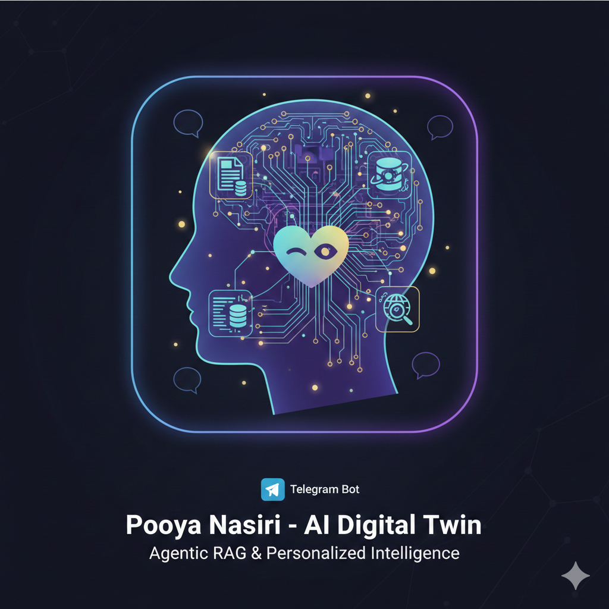

# 🤖 AI Digital Twin (Agentic RAG)



A smart Telegram Bot that acts as a "Digital Twin" of **Pooya Nasiri**. It uses **Agentic RAG** (Retrieval Augmented Generation) to answer questions based on Pooya's personal data, checks live GitHub activity, searches the web, and mimics his personality (sarcastic, helpful, and multilingual).

The entire project is architected to run **100% Free** using the free tiers of enterprise AI services.

---

## 🚀 Features

* **🧠 Long-Term Memory (RAG):** Ingests PDFs, chat logs, and text notes to learn Pooya's history, resume, and opinions using **Pinecone** and **Gemini Embeddings**.
* **💻 Live Coding Awareness:** Connects to the **GitHub API** to answer "What are you working on right now?" with real-time repo updates.
* **🌍 Live Web Access:** Uses **Tavily AI** to search the internet for current events, weather, or Pooya's public social media updates.
* **🎭 Adaptive Persona:**
    * Speaks in the **third person** ("Pooya thinks...").
    * Auto-detects language: English 🇺🇸 (Sarcastic/Professional) vs. Persian/Farsi 🇮🇷 (Warm/Polite).
    * "Never Give Up" Logic: Falls back to general knowledge if specific memory is missing, while maintaining persona.
* **☁️ Cloud Native:** Deployed on **Render (Free Tier)** with a Flask keep-alive mechanism.

---

## 🛠️ The "Free Forever" Tech Stack

| Component | Service / Library | Tier |
| :--- | :--- | :--- |
| **LLM (Brain)** | [Google Gemini 2.5 Flash](https://aistudio.google.com/app/apikey) | Free (15 RPM) |
| **Vector DB** | [Pinecone Serverless](https://www.pinecone.io/) | Free (2GB storage) |
| **Orchestrator** | [LangChain](https://docs.langchain.com/) & [LangGraph](https://docs.langchain.com/) | Open Source |
| **Search Tool** | [Tavily AI](https://tavily.com/) | Free (1k req/month) |
| **Hosting** | [Render](https://render.com/) | Free Web Service |
| **Bot Interface** | [Telegram API](https://core.telegram.org/) | Free |

---

## 📂 Project Structure

```text
PooyaBot/
├── data/                  # Place your PDFs, .txt chats, and resumes here
├── bot.py                 # Main Agent logic (LangGraph + Flask + Telegram)
├── ingest.py              # Script to vectorize 'data/' and save to Pinecone
├── requirements.txt       # Python dependencies
├── .env                   # API Keys (Local development only)
└── README.md              # Documentation
```

---

## ⚡ Local Setup & Installation

### 1. Prerequisites
Ensure you have Python 3.11 installed (Recommended for stability with LangChain components).

### 2. Clone the Repo
```bash
git clone https://github.com/PooyaNasiri/PooyaBot.git
cd PooyaBot
```

### 3. Install Dependencies
```bash
pip install -r requirements.txt
```

### 4. Configure Environment Variables
Create a `.env` file in the root directory and add your keys:
```ini
GOOGLE_API_KEY="your_gemini_key"
PINECONE_API_KEY="your_pinecone_key"
TAVILY_API_KEY="your_tavily_key"
GITHUB_TOKEN="your_github_token"
TELEGRAM_TOKEN="your_telegram_bot_token"
```

### 5. Ingest Data (Train the Brain)
Place your resume, exported chats, or bio in the `data/` folder, then run:
```bash
python ingest.py
```
This creates embeddings and uploads them to your Pinecone index.

### 6. Run the Bot
```bash
python bot.py
```

---

## ☁️ Deployment (Render.com)

This bot uses a Flask sidecar to keep the Render Free Tier active (it listens on a port to satisfy Render's web service requirements).

1. Fork/Push this repo to your GitHub.
2. Create a new **Web Service** on Render.com.
3. Connect your repository.

**Settings:**
- Runtime: Python 3  
- Build Command: `pip install -r requirements.txt`  
- Start Command: `python bot.py`  

**Environment Variables:**  
Add all 5 keys from your `.env` file into Render's dashboard.

**Python Version:**  
Add env variable `PYTHON_VERSION=3.11.9` (critical for build speed).

**Keep Awake:**  
Use a free cron service (e.g., cron-job.org) to ping your Render URL every 14 minutes.

---

## 🧠 Logic Flow (LangGraph)

1. **Input:** User sends a message on Telegram.
2. **Routing:** Gemini decides which tool to use:
   - Personal Question → `check_my_memory` (Pinecone)
   - Coding Question → `check_github_activity` (GitHub API)
   - General / News → `web_search` (Tavily)
3. **Processing:** Agent executes the tool and gets raw data.
4. **Synthesis:** Gemini combines tool output with the *Pooya Persona* (sarcastic, third-person).
5. **Output:** Sent back to Telegram.

---

## 🔹 Live Demo (Telegram)

A fully functional live demo of this project is available on Telegram.

You can interact with the AI Digital Twin exactly as designed — asking personal questions, technical questions, or general topics — and observe real-time RAG, tool usage, and persona behavior in action.

👉 **Telegram Bot:** [@PooyaCoreBot](https://t.me/PooyaCoreBot) 

No installation or setup required. Just open the link and start chatting.

---

## 📝 License
This project is open-source and available under the **Apache License 2.0**.

Built with ❤️ by [**Pooya Nasiri**](https://github.com/PooyaNasiri)
    - [Portfolio](https://pooyanasiri.github.io)
